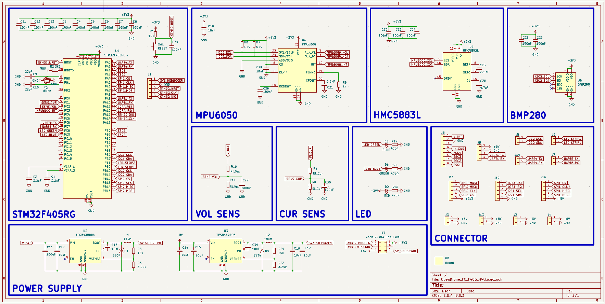
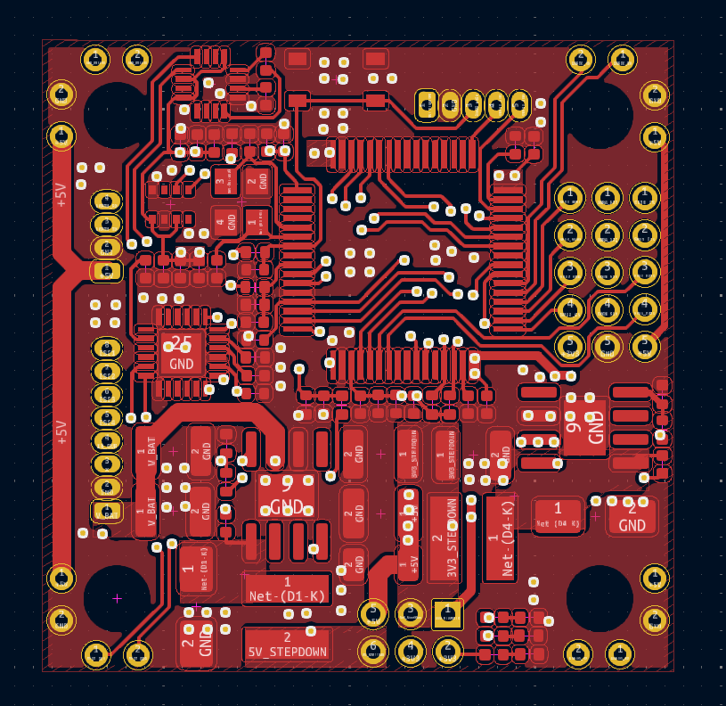
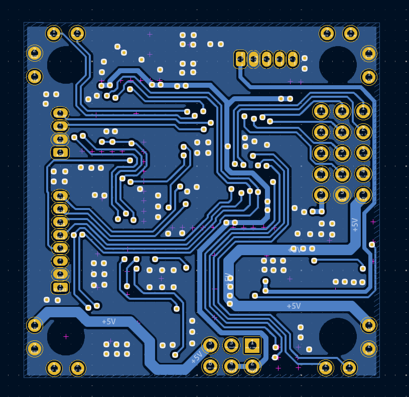
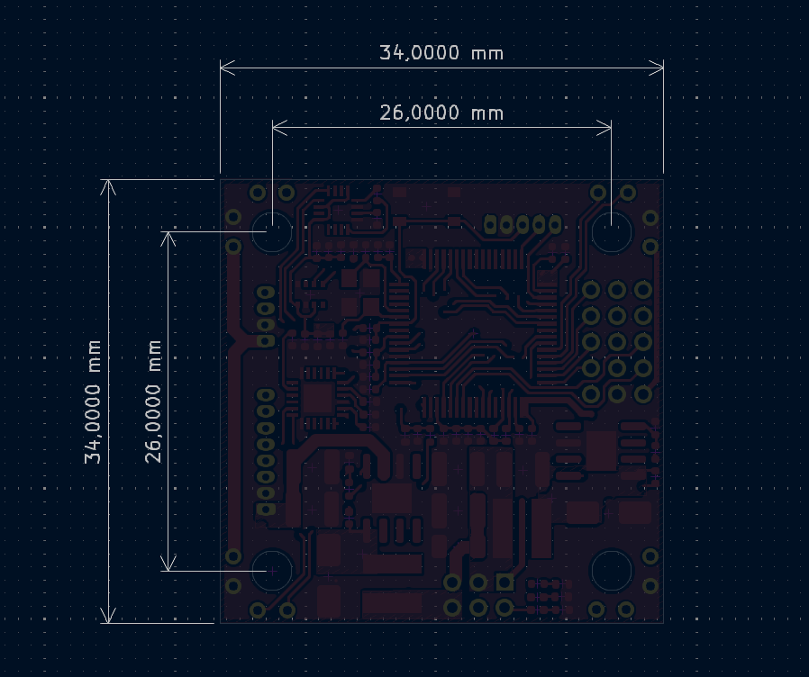

# OpenDrone_FC_F405_HW

Version 1.0

### Overview

OpenDrone Project - Fly Controller hardware using STM32F405RG.

### Specifications

### Layout/Pin map

### Design

#### Schematic

#### PCB

F.Cu

B.Cu

#### 3D top

#### 3D bottom

#### Dimension

### Bill of materials (BOM)

[Download v1.0](../BOM/BOM_OpenDrone_FC_F405_HW_v1.0.xlsx)

### Gerber

[Download v1.0](../Gerber/Gerber_OpenDrone_FC_F405_HW_v1.0.zip)
