# OpenDrone_FC_F405_HW

### Overview

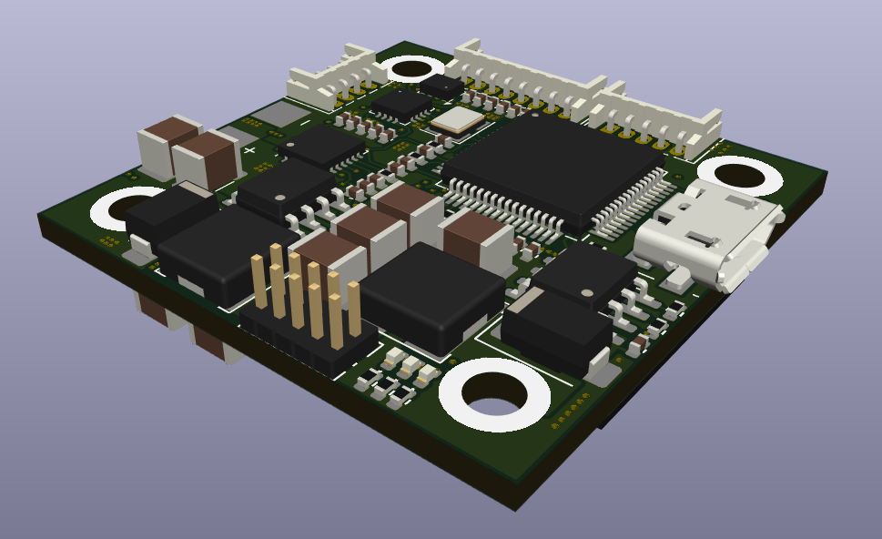

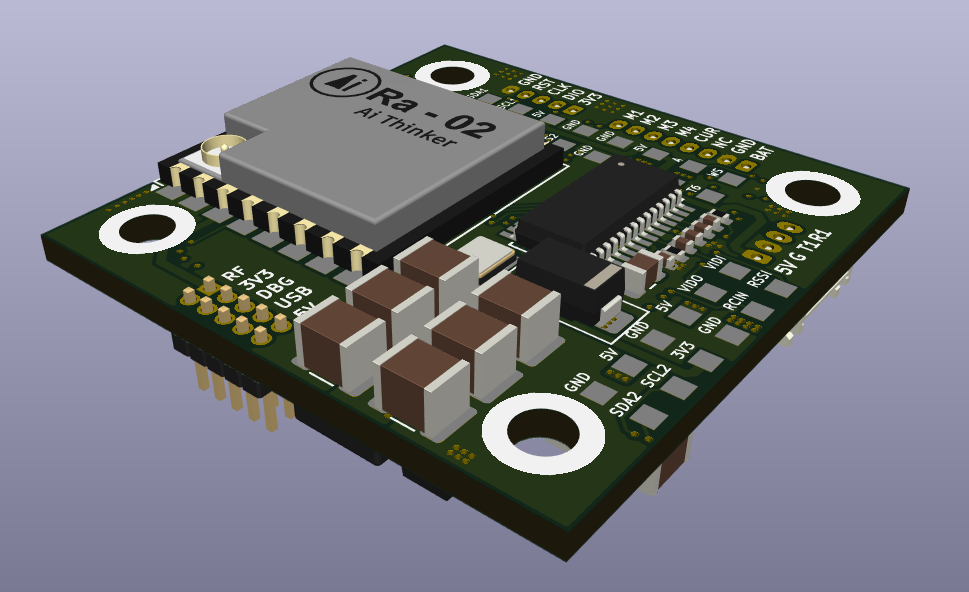

OpenDrone Project - Fly Controller hardware using STM32F405RG.

### Specifications

### Layout/Pin map

### Design

#### Schematic

[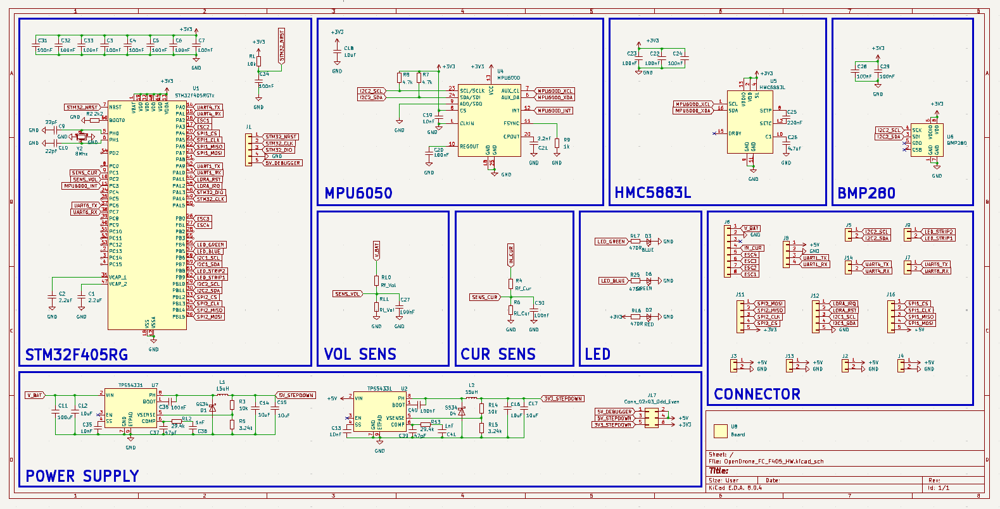](Assets/OpenDrone_FC_F405_HW_v1.pdf)

#### PCB

F.Cu

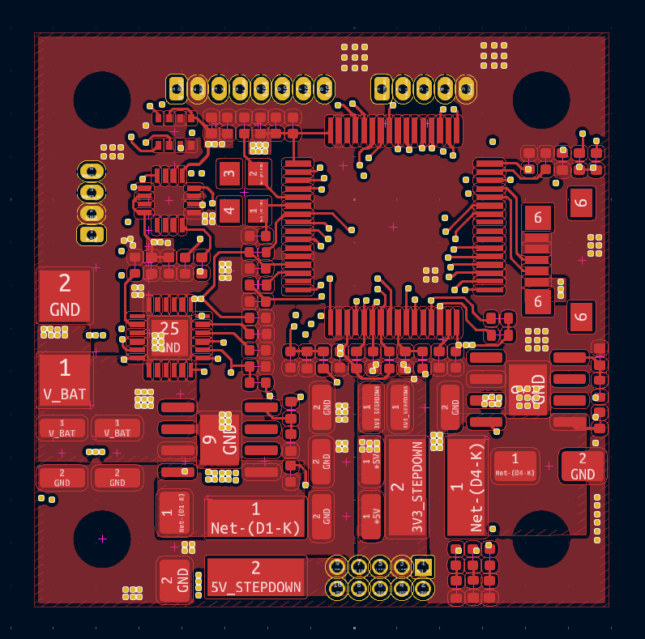

In1.Cu

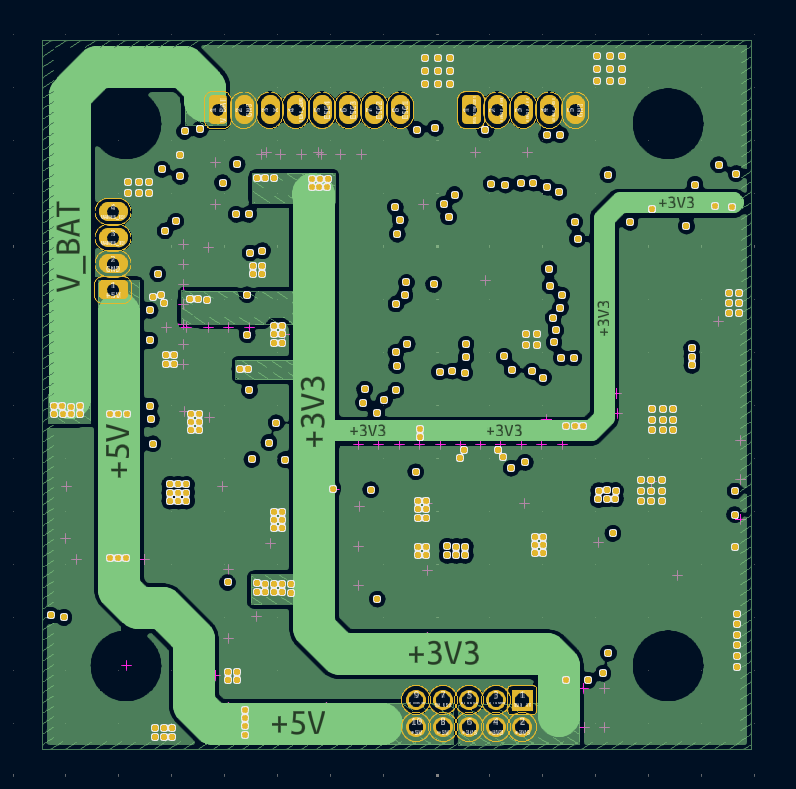

In2.Cu

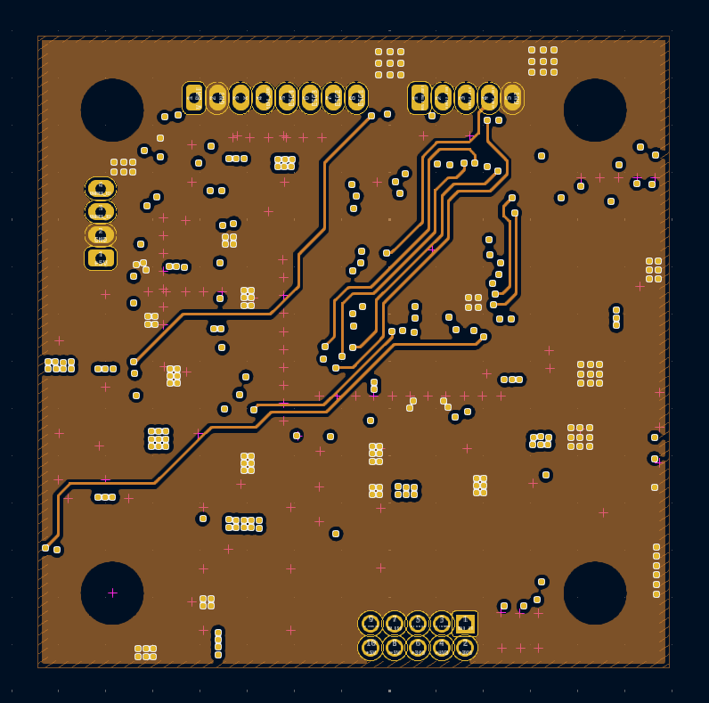

In3.Cu

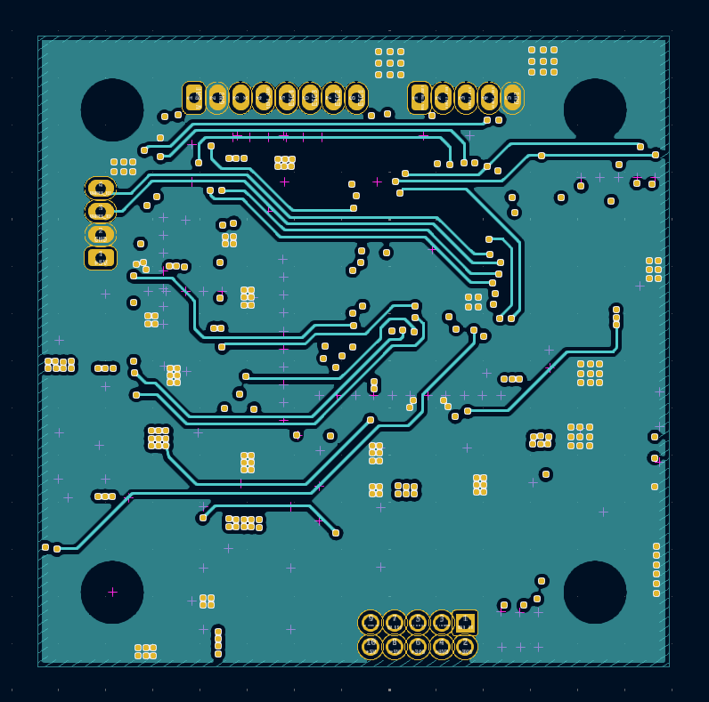

In4.Cu

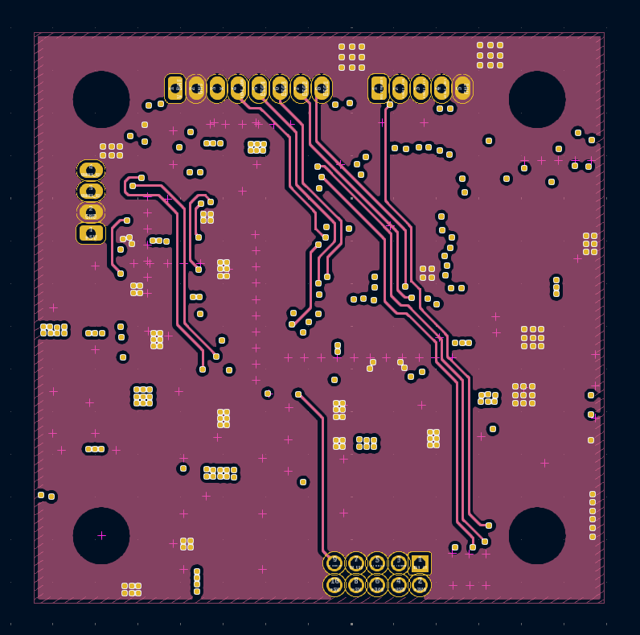

In5.Cu

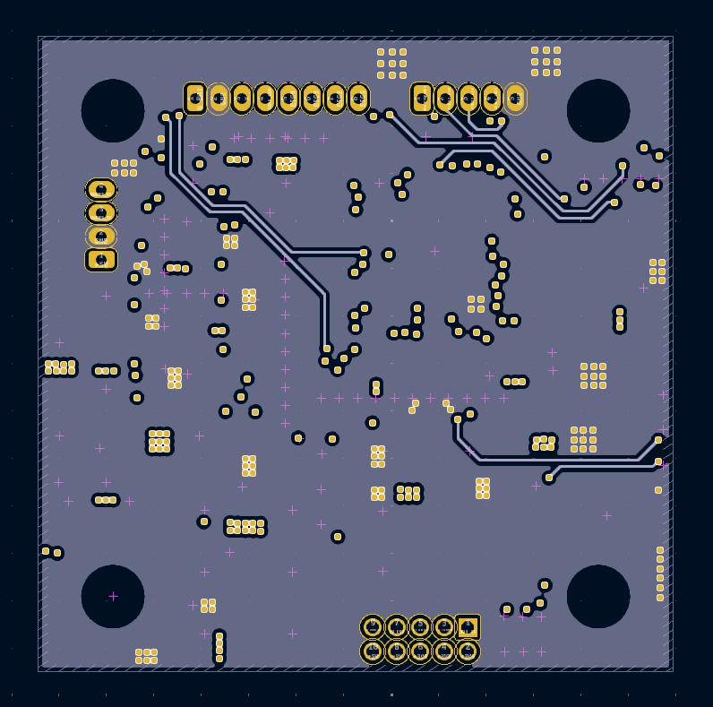

In6.Cu

B.Cu

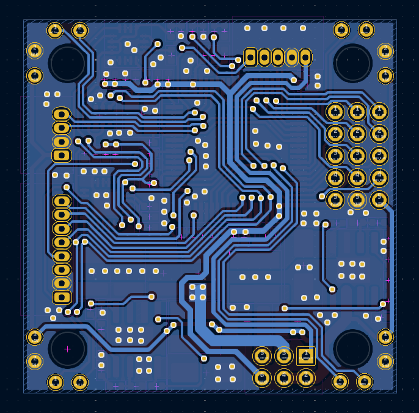

#### 3D top

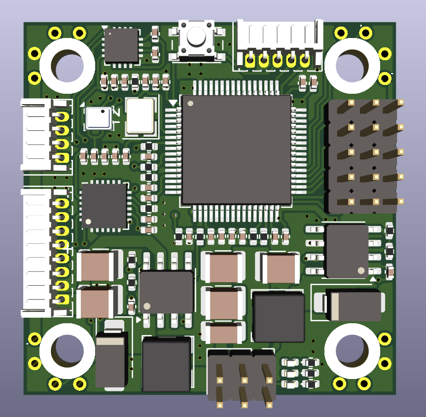

#### 3D bottom

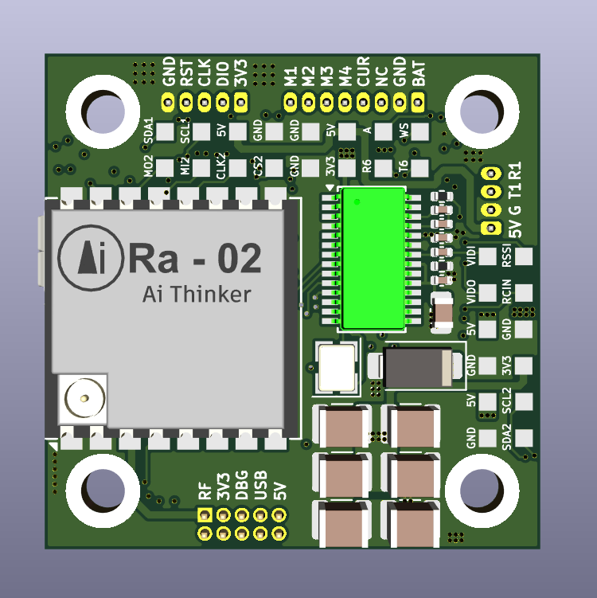

#### Dimension

### Bill of materials (BOM)

[Download v1](Assets/BOM/OpenDrone_FC_F405_HW_v1.xlsx)

### Gerber

[Download v1](Assets/Gerber/OpenDrone_FC_F405_HW_v1.zip)
